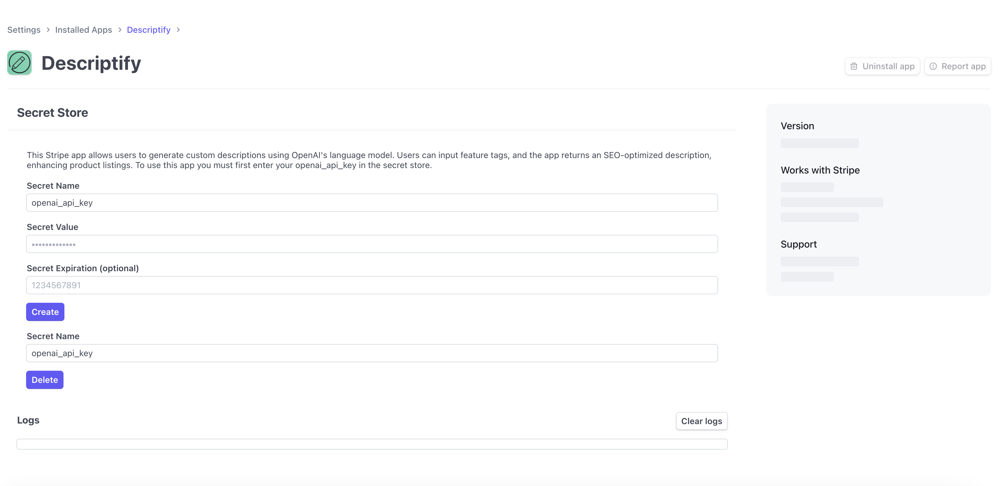

# descriptify
A stripe app to generate SEO-friendly product descriptions for better listings.

Descriptify Uses OpenAI to generate clear and engaging product descriptions that are optimized for search engines. By automatically crafting these descriptions, it saves you time and effort while enhancing the visibility of your listings. With Descriptify, you can easily showcase your products in a way that attracts more customers and drives sales.

Sure! Here’s a revised version of your content:

Sure! Here's how you can incorporate markdown for images into your feature description:

---

### Key Features

- **AI-Driven Descriptions**: 
  Leverage OpenAI's powerful language model to swiftly generate clear and engaging product descriptions that are optimized for SEO, all with just a few clicks.

- **Intuitive User Interface**: 
  Designed for ease of use, allowing users to effortlessly input product details and tag features, simplifying the description creation process.

- **Effortless Stripe Integration**: 
  Smoothly connects with Stripe, enabling users to update their product listings directly through the app, eliminating technical barriers.

---

- **Alt Text**: This text describes the image and is useful for accessibility purposes.

You can adjust the descriptions and image URLs as needed. If you have specific images you plan to use, just substitute the placeholders. Let me know if there's anything else you'd like to add!

Feel free to adjust any part of it further! Let me know if you need anything else.